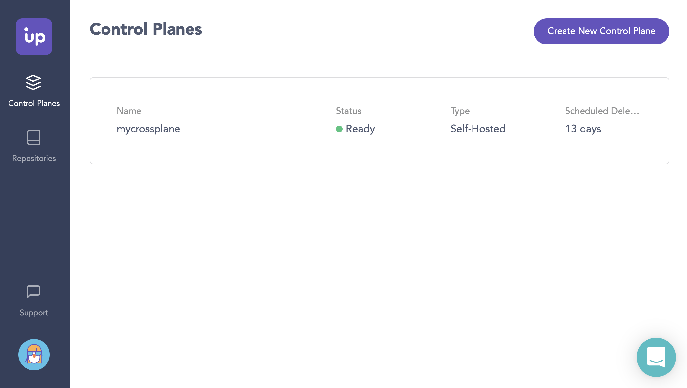

# Upbound Universal Crossplane (UXP)

<a href="https://upbound.io/uxp">
    
</a>

Upbound Universal Crossplane (UXP) is [Upbound's][upbound] official
enterprise-grade distribution of [Crossplane][crossplane]. It's fully compatible
with upstream Crossplane, open source, capable of connecting to Upbound Cloud
for real-time dashboard visibility, and maintained by Upbound. It's the easiest
way for both individual community members and enterprises to build their
production control planes.

## Quick Start

1. Install the [Upbound CLI][upbound-cli].

   ```console
   curl -sL https://cli.upbound.io | sh
   ```
   
    To install with Homebrew:
    ```console
    brew install upbound/tap/up
    ```

2. Install UXP to a Kubernetes cluster.

   ```console
   # Make sure your ~/.kube/config file points to your cluster
   up uxp install
   ```

3. [Create an Upbound account][create-account] for a free dashboard for UXP.

4. Connect UXP to Upbound Cloud.

   ```console
   # The name of your new UXP control plane.
   UXP_NAME=mycrossplane

   up cloud login
   up cloud controlplane attach ${UXP_NAME} | up uxp connect -
   ```

5. Manage your UXP control plane by [signing in][login] to your Upbound account.



### Installation With Helm 3

Helm requires the use of `--devel` flag for versions with suffixes, like
`v1.2.1-up.3`. But Helm repository we use is the stable repository so use of that
flag is only a workaround, you will always get the latest stable version of UXP.

1. Create the namespace to install UXP.

   ```console
   kubectl create namespace upbound-system
   ```

1. Add `upbound-stable` chart repository.

   ```console
   helm repo add upbound-stable https://charts.upbound.io/stable && helm repo update
   ```

1. Install the latest stable version of UXP.

   ```console
   helm install uxp --namespace upbound-system upbound-stable/universal-crossplane --devel
   ```

### Upgrade from upstream Crossplane

In order to upgrade from upstream Crossplane, the target UXP version has to match
the Crossplane version until the `-up.N` suffix. For example, you can upgrade from
Crossplane `v1.2.1` only to a UXP version that looks like `v1.2.1-up.N` but not to
a `v1.3.0-up.N`. It'd need to be upgraded to upstream Crossplane `v1.3.0` and then
UXP `v1.3.0-up.N`.

#### Using up CLI

   ```console
   # Assuming it is installed in "crossplane-system" with release name "crossplane".
   up uxp upgrade -n crossplane-system
   ```

If you'd like to upgrade to a specific version, run the following:

   ```console
   # Assuming it is installed in "crossplane-system" with release name "crossplane".
   up uxp upgrade vX.Y.Z-up.N -n crossplane-system
   ```

#### Using Helm 3

   ```console
   # Assuming it is installed in "crossplane-system" with release name "crossplane".
   helm upgrade crossplane --namespace crossplane-system upbound-stable/universal-crossplane --devel
   ```

If you'd like to upgrade to a specific version, run the following:

   ```console
   # Assuming it is installed in "crossplane-system" with release name "crossplane".
   helm upgrade crossplane --namespace crossplane-system upbound-stable/universal-crossplane --devel --version vX.Y.Z-up.N
   ```

## Additional Resources

- The [UXP Documentation][uxp-documentation] provides additional information
  about UXP and resources for developers, like examples.
- The [developer guide][developer-guide] describes how to build and run UXP
  locally from source.
- [UXP Slack][uxp-slack] is where you can go to get all of your UXP questions
  answered.

[upbound]: https://upbound.io
[crossplane]: https://crossplane.io/
[upbound-cli]: https://github.com/upbound/up
[create-account]: https://cloud.upbound.io/register
[login]: https://cloud.upbound.io/login
[uxp-documentation]: https://cloud.upbound.io/docs/uxp
[developer-guide]: docs/developer-guide.md
[uxp-slack]: https://crossplane.slack.com/archives/uxp
