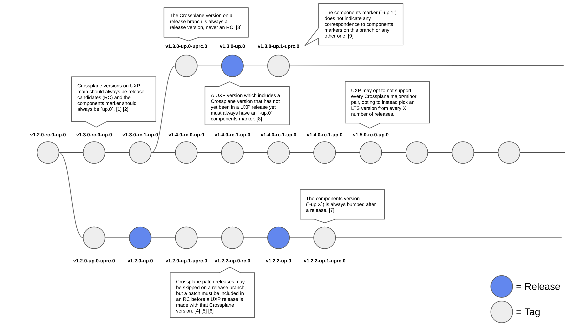

# Versioning

Universal Crossplane (UXP) uses a semantic versioning system based on the
upstream Crossplane versioning to identify releases. UXP embeds Crossplane
itself in its Helm chart, so the major, minor, and patch version of any UXP
release will always match the embedded Crossplane major, minor, and patch
version. The following sections describe the UXP versioning strategy, including
when branches are cut, dependency tags are incremented, and new versions are
released.

## Format

The UXP version string is formatted as a semantic version with appended
pre-release information:

```
v<major>.<minor>.<patch>-up.<components>
```

The `<major>`, `<minor>`, and `<patch>` segments each refer to the corresponding
embedded Crossplane `<major>`, `<minor>`, and `<patch>` versions. The embedded
Crossplane version may differ from upstream Crossplane (i.e. Upbound may release
patch versions past the end of life date for a Crossplane branch), but if the
specified version exists upstream, the contents will match exactly.

The `<components>` segment is a numeric identifier describing the collective
version of software components that surround Crossplane in a UXP release. The
`-up.<components>` segment must be a [valid semver pre-release
segment](https://semver.org/#spec-item-9). Pre-release information is used
instead of [build metadata](https://semver.org/#spec-item-10) as pre-release
precedence is honored in semantic versioning. The `<components>` numeric
identifier only corresponds to the version of components for its preceding
`<major>`, `<minor>`, `<patch>` versions. There is no relationship between
`<components>` versions across `<major>`, `<minor>`, `<patch>` versions (e.g.
`v1.2.0-up.1` does not indicate any correspondence to components in
`v1.3.0-up.1`).

An example version string for a UXP release that embeds Crossplane `v1.3.0`
could be:

```
v1.3.0-up.2
```

Additional pre-release segments may be appended both before and after the
`-up-<components>` segment. Any pre-release segments appended before will
correspond to the embedded Crossplane version (e.g. `v1.4.0-rc.0-up.1`). Any
pre-release segments appended after will correspond to a pre-release version of
UXP itself (e.g. `v1.4.0-up.1-uprc.0`). UXP pre-release release segments should
use `up` prefixed identifiers (e.g. `uprc`). There should _never_ be both a
Crossplane pre-release and UXP pre-release on the same version string (see
[Guarantees section](#guarantees)).

## Terms

The following terms are used throughout this document and are defined as
follows:

- **UXP Version**: the entire semantic version for a UXP release (e.g.
  `v1.2.2-up.3`).
- **Crossplane Version**: the version of Crossplane embedded in the UXP release
  (e.g. `v1.2.2`).
- **Components Marker**: the version of the components surrounding upstream (or
  temporarily forked) Crossplane (e.g. `-up.3`).

## Guarantees



The UXP versioning strategy can be expressed through a series of guarantees,
each of which are elaborated in the subsequent sections. The diagram above
illustrates examples of each guarantee in practice.

1. The components marker on UXP main should always end in `-up.0` (i.e. no
   components release candidates).
2. The Crossplane version on UXP main must always be a release candidate version
   for the first release of a major/minor pair (i.e. `vX.Y.0-rc.Z`).
3. The Crossplane version on any `release-*` branch should _always_ be a
   Crossplane release version (e.g. `v1.2.2`) (i.e. no release candidates).
4. Not every Crossplane patch for a given `<major>`/`<minor>` version must be
   included in a UXP release, even if the `<major>`/`<minor>` version has been
   selected for long-term service (LTS). This would typically occur if
   Crossplane made multiple patch releases in quick succession and a UXP version
   had not been released for each in the intermediate (e.g. if `v1.2.4` is
   released in upstream Crossplane and has not been included in a UXP release
   before `v1.2.5` is released upstream, UXP may elect to forego cutting a
   release with `v1.2.4`).
5. At least one release candidate (RC) version should exist for any version that
   is released. This is typically accomplished by merging an empty commit, then
   tagging the RC version for the _next_ release immediately after release of
   the preceding version.
6. As a consequence of the preceding rule, a UXP version on a `release-*` branch
   may end in `-uprc.X` (e.g. `v1.2.2-up.4-uprc.0`).
7. A release _always_ results in the subsequent tag on the same branch to have
   an incremented components version (e.g. the tag after `v1.2.2-up.2` must
   include `-up.3`).
8. A release for an embedded Crossplane version that has not yet been included
   in a UXP release must have a components marker of `-up.0`.
9. The components marker does not indicate the same components across Crossplane
   versions or release branches. It is specific to the Crossplane version it is
   appended to (e.g. `v1.2.2-up.1` does not indicate the same version of `xgql`
   / `agent` / `bootstrapper` / etc. as `v1.3.0-up.1`).

### Crossplane Version on Main

The Crossplane version on the UXP repository `main` branch should always match
that of the latest Crossplane tag on `master`. This ensures that we are always
moving towards the next release branch cut that both Crossplane and UXP will
make. By definition, this also means that the Crossplane version on UXP `main`
will always be an RC version (e.g.`v1.4.0-rc.0-up.0`)

### Crossplane Version on Release Branches

Crossplane cuts a release branch for every `<minor>` version release (e.g.
`release-1.3`). UXP follows the same strategy and will cut a matching release
branch for every corresponding upstream release branch. The embedded Crossplane
version on each UXP release branch should match the latest tag on the
corresponding branches in the Crossplane repo. This ensures that a UXP release
branch is always tracking toward the next Crossplane patch release for that
`<major>`/`<minor>`. Crossplane RC versions are never present on a release
branch because UXP will never be released with an embedded Crossplane version
that is not an official release.

### UXP Version

The UXP version (i.e. `-up.0`) is independent for every Crossplane version. The
version in main should always be `-up.0` because we cannot release `-up.0` for a
given version until it has its first patch release (i.e. `vX.Y.0-up.0`). A UXP
release candidate (e.g. `v1.4.0-up.0-rc.0`) should be tagged and tested prior to
any official release. In practice, this is accomplished by _always_ tagging the
next release candidate after cutting an official release.

### Features on Release Branches (Backport Policy)

UXP honors semantic versioning in that it will not introduce any breaking
changes in releases with the same major version (e.g. `v1`). The implication of
this is that UXP can never introduce breaking changes until Crossplane does.

UXP differs from Crossplane in that it may backport features to a release
branch. It is up to the discretion of the maintainers whether a UXP component
update with new features should be included on a release branch.

## Long-Term Support

UXP's long-term support (LTS) strategy is not currently formally defined. As the
needs of users become more apparent, and the burden of maintaining many branches
is better understood, a formal support window will be defined. In the mean time,
UXP maintainers will prioritize supporting the needs of Upbound customers when
making decisions about maintenance and support.
